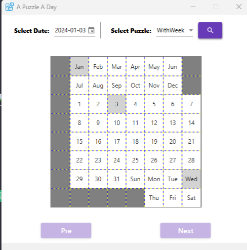
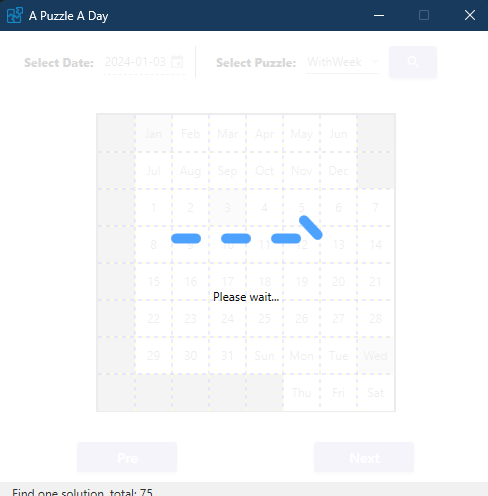
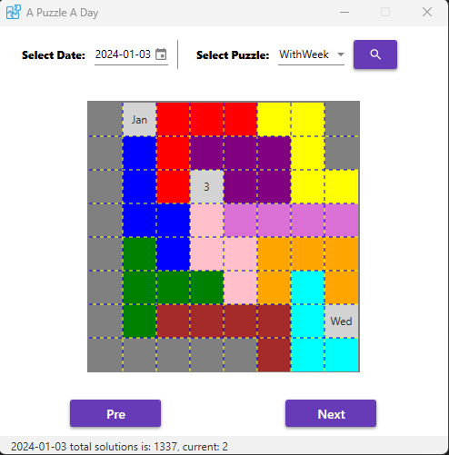

# A Puzzle A Day Solver


***A Puzzle A Day Solver*** is a graphical interface program designed to solve daily puzzles, providing users with solutions to different puzzles each day. Developed in C#, the project offers an intuitive user interface for quick and easy access to answers.

## About
***A Puzzle A Day*** has two versions: one without the inclusion of weekdays and another version that includes weekdays. Currently, we have successfully supported both versions.

Our solution is capable of supporting queries for all puzzle answers and provides a preview function, allowing users to quickly browse through all solutions.

- **Startup**


- **Running**


- **Result**


## Features
- Solve Daily Puzzles: Provides solutions to daily puzzles, allowing users to quickly find the answers using the program.
- Graphical User Interface: User-friendly interface design for a straightforward and intuitive user experience.
- Customization Support: Customize solving parameters and options based on user preferences.

## Installation
### .Net Developer
1. The project is based on .NET 8. If you need to run and compile this project, please install [.NET 8 SDK](https://dotnet.microsoft.com/en-us/download/dotnet/8.0) first.
2. Please use Visual Studio 2022 to open this solution.
3. Clone the project to your local machine:

    ```bash
    > git clone https://github.com/tracyma-05/puzzle.git

    > cd Puzzle

    > dotnet build
    ```
### Other
1. If you had install .NET 8 SDK, then just download the Framework-dependent version
2. If you don't want to install SDK, then you can download the self-contained version

## License
This project is licensed under the MIT License - see the [LICENSE file](./LICENSE) for more details.

## Contact
For further questions or assistance, please contact us through the following:
- Email: zhongbin_ma@outlook.com
- Submitting an issue: [GitHub Issues](https://github.com/tracyma-05/Puzzle/issues)

Thank you for using my application!